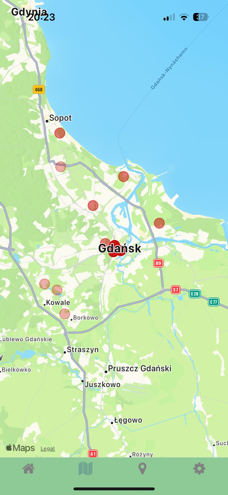
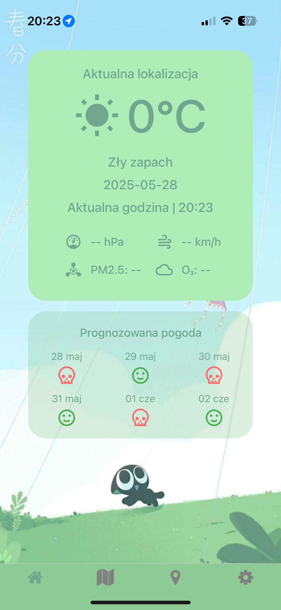
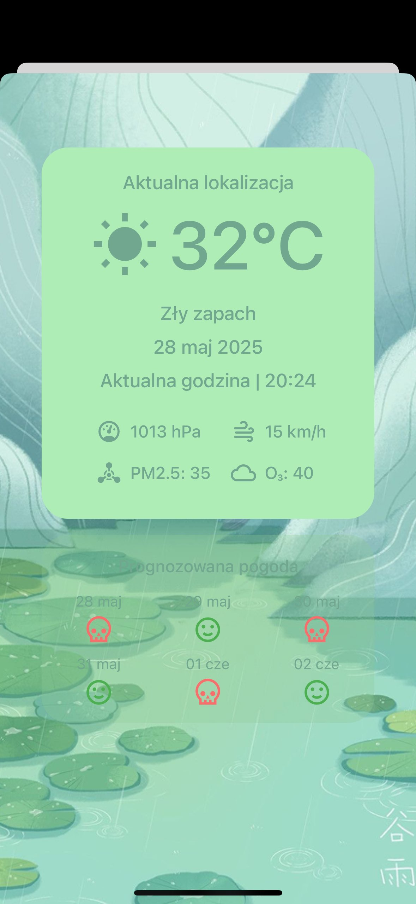
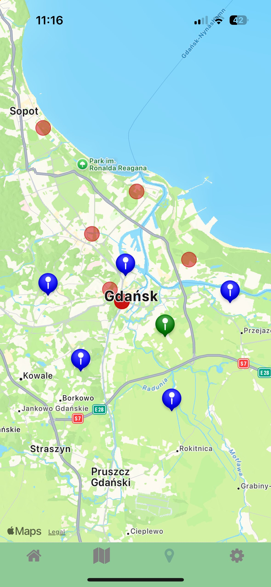

# Mobile Application for Air Quality Monitoring

**Engineering Thesis Project**  
Author: *Krystian Jank*  
Technologies: **React Native (Expo), JavaScript, REST API**  
Completion Date: *07.2025*

## Project Description

This mobile application allows users to monitor current and forecasted weather conditions as well as air quality levels in selected locations. The project was developed as part of an engineering thesis. It is built using **React Native with Expo**, which enables the application to run on both **Android** and **iOS** devices.

The application communicates with an external server to retrieve weather data and air quality indicators (such as PM2.5 and O₃). Data is refreshed periodically and also on user request.

### Key Features
- Display of current temperature and air quality index
- Detailed pollutant indicator overview
- Multi-language support (language switching in settings)
- Saving and managing favorite locations
- Mobile-optimized user interface
- Communication with the server through a REST API
- Integrated unit and component tests

### Technologies Used
- **React Native + Expo**
- **React Navigation**
- **Zustand**
- **Axios**
- **React Native Testing Library**

### Installation and Running the Application
```bash
git clone <repo-url>
cd <project-folder>
npm install
npx expo start
```

## Screenshots

<div style="display: flex; gap: 10px; flex-wrap: wrap;">
  
  
  
  
</div>
